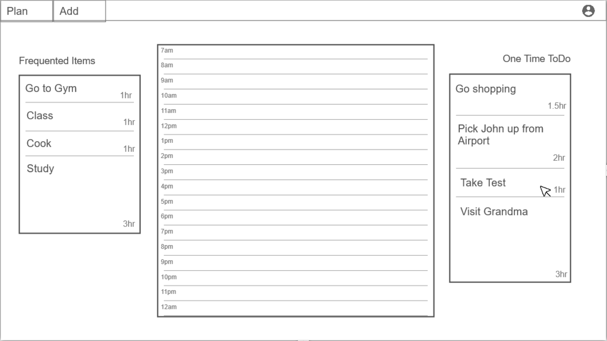

# Daily Planner

## Specification

### Elevator Pitch

A quick and easy way to plan out your day! Write down and save your todo items and how long they will take you. Once the day comes to get it done, simply drag and drop the item into the time slot you plan on doing it. There will be two lists holding different types of items: frequent items that will never be removed from the list no matter how many times you plan them, and one time todo items which will no longer be in the list once they are planned. This will make it super easy to plan all parts of your day, things like going to the gym or going to class can be on the frequent list, and things like a friends birthday party, an event or even just an uncommon chore can be on the todo list. This makes for effortless productivity and time management!

### Design

### Key Features
* Secure login over HTTPS
* Persistent user accounts with saved todo items and schedules
* Add, edit, and remove todo items categorized as recurring or one-time
* Drag-and-drop interface for building a daily schedule
* Automatic removal of one-time items once scheduled
* Reusable recurring items that can be scheduled multiple times
* Visual representation of a full day broken into time blocks
* Schedule data saved and restored on refresh or re-login

### Technologies

* HTML - Structure the application. 
* CSS - Stylize pages, animate drag and drop. Ensure clean spacing and consistent color choices.
* React - Provides UI for login and schedule display. Handles drag and drop logic. 
* Service - Register users and verify login. Retrieve user data to display correct todo items. 
* Database - Store authentication information, users, and user data including items and schedules. 
* WebSocket - Broadcast real-time schedule updates across an account on multiple devices.
